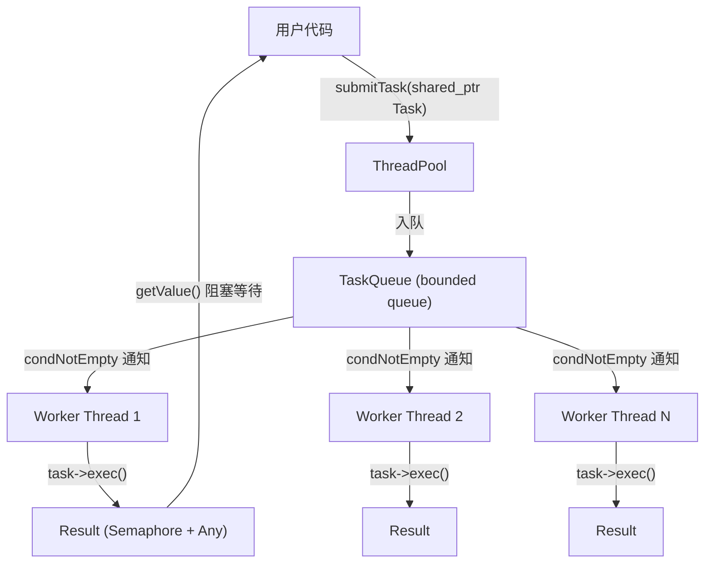

# C++17 线程池库 — 项目深度解读与简历建议

---

## 一、项目概览

这是一个基于 **C++17** 从零手写的 **线程池（ThreadPool）** 库，采用经典的 **生产者-消费者** 模型，支持两种工作模式：

- **FIXED 模式**：固定数量工作线程，适合稳定负载
- **CACHED 模式**：根据任务量动态创建/回收线程（空闲 60s 自动销毁），适合突发性短任务

整体代码约 **300+ 行核心代码**，涉及线程同步、类型擦除、信号量、RAII 资源管理等多项 C++ 高级特性。

---

## 二、架构设计



### 核心类职责

| 类 | 文件 | 职责 |
|---|---|---|
| **ThreadPool** | `include/ThreadPool.h` / `src/ThreadPool.cpp` | 线程池主体：管理线程生命周期、任务队列、模式切换 |
| **Thread** | `include/Thread.h` / `src/Thread.cpp` | 线程封装：detach 执行，静态 ID 分配 |
| **Task** | `include/Task.h` / `src/Task.cpp` | 抽象任务基类：用户继承重写 `run()` |
| **Result** | `include/Result.h` / `src/Result.cpp` | 异步结果：信号量阻塞等待 + Any 存储返回值 |
| **Any** | `include/Any.h` | 类型擦除容器：Base/Derived 多态 + RTTI |
| **Semaphore** | `include/Semaphore.h` | 计数信号量：mutex + condition_variable |
| **PoolMode** | `include/PoolMode.h` | 枚举：FIXED / CACHED |

---

## 三、关键技术点与数据流

### 1. 任务提交流程 (`submitTask`)

```
用户调用 submitTask(shared_ptr<Task>)
  -> 加锁 mutex_
  -> condNotFull_ 等待队列有空位（超时 1s 返回失败）
  -> 入队 taskQueue_
  -> condNotEmpty_.notify_all() 唤醒工作线程
  -> CACHED 模式下判断是否需要动态创建新线程
  -> 返回 Result 对象（NRVO/copy elision）
```

### 2. 工作线程执行流程 (`threadHandler`)

```
for (;;)
  -> 加锁 mutex_
  -> 等待任务（FIXED: condNotEmpty_.wait; CACHED: wait_for 1s + 空闲超时回收）
  -> 检查退出条件（!isRunning_ 时清理自身并 notify exitCond_）
  -> 取出队头任务，释放锁
  -> task->exec() 执行用户逻辑
  -> exec() 内部调用 run() 并通过 Result::setValue() 设置返回值
  -> Semaphore::post_() 通知等待结果的用户线程
```

### 3. 类型擦除 (Any)

手动实现了类似 `std::any` 的类型擦除机制：

```cpp
// Base (抽象基类) -> Derived<T> (模板派生类持有具体数据)
// 存储：unique_ptr<Base> 指向 Derived<T>
// 取出：dynamic_cast<Derived<T>*> + RTTI
```

这是 C++ 中经典的 **类型擦除（Type Erasure）** 设计模式，体现了对多态和模板的深入理解。

### 4. 线程动态伸缩 (CACHED 模式)

- **扩容**：`submitTask` 时若 `taskQueue.size() > idleThreadNum && totalThreadNum < threshold`，动态创建新线程
- **缩容**：`threadHandler` 中 CACHED 线程每秒检查一次，空闲超过 60s 且线程数 > 初始数量时自动回收

---

## 四、项目优点

### 技术深度方面

1. **手写线程同步原语**：自行实现了 `Semaphore`（基于 mutex + condition_variable），展示了对操作系统同步原语的理解
2. **类型擦除设计模式**：手动实现 `Any` 类，使用 Base/Derived + RTTI 实现运行时类型安全转换
3. **生产者-消费者模型**：使用 `condNotFull_` / `condNotEmpty_` 双条件变量实现有界阻塞队列
4. **RAII 资源管理**：线程池析构时自动等待所有线程退出，使用 `unique_ptr` 管理线程对象生命周期
5. **C++17 特性运用**：结构化绑定、`enum class`、`make_unique`、guaranteed copy elision 等

### 工程设计方面

6. **双模式设计**：FIXED / CACHED 两种模式满足不同负载场景，类似 Java `Executors.newFixedThreadPool` / `newCachedThreadPool`
7. **模块化分层清晰**：头文件/源文件分离，每个类职责单一，符合单一职责原则
8. **可配置性**：支持设置队列上限、线程上限、工作模式等参数
9. **跨平台构建**：CMake 构建，兼容 Windows（MSVC）和 Linux/macOS（pthread）

### 编程素养方面

10. **禁用拷贝语义**：ThreadPool 禁止拷贝赋值，防止资源管理错误
11. **原子变量的使用**：`isRunning_`、`idleThreadNum_`、`totalThreadNum_` 均使用 `atomic`，线程 ID 生成器使用 `std::atomic<int>`
12. **问题记录与反思**：项目中的 `ISSUES.md` 记录了已知问题和修复方案，展示了自我代码审查能力

---

## 五、简历描述建议

### 版本 A（简洁版，适合项目经历一栏）

> **C++ 线程池库** | C++17, CMake, 多线程编程
>
> - 基于 C++17 从零实现高性能线程池，采用**生产者-消费者模型**，通过 mutex + condition_variable 实现线程安全的有界任务队列
> - 支持 **FIXED（固定线程数）** 和 **CACHED（动态伸缩）** 两种工作模式；CACHED 模式下根据任务负载自动创建线程，空闲超时自动回收，实现线程资源的弹性管理
> - 手动实现**类型擦除容器（Any）** 和**计数信号量（Semaphore）**，支持任务异步提交与结果阻塞获取
> - 使用 RAII 机制管理线程生命周期，析构时自动等待所有工作线程安全退出，防止资源泄漏

### 版本 B（技术突出版，适合面试深挖）

> **高性能 C++ 线程池** | C++17, 多线程, 操作系统
>
> - 独立设计并实现支持**双模式（Fixed/Cached）** 的线程池框架，核心运用生产者-消费者模型、条件变量同步、原子操作等并发编程技术
> - 实现 **Type Erasure** 设计模式，通过 Base/Derived 多态 + RTTI 动态转型，使线程池支持返回任意类型结果
> - CACHED 模式实现**线程动态伸缩**：任务激增时自动扩容，空闲 60s 后自动回收多余线程，兼顾吞吐量与资源利用率
> - 深入排查并修复析构阶段的**死锁问题**（线程退出路径未统一清理），通过代码审查发现 Result 裸指针生命周期、非原子 ID 生成等共 7 项潜在缺陷

### 可以在面试中展开聊的技术点

- **为什么不用 `std::any`？** — 为了深入理解类型擦除原理而手动实现
- **FIXED vs CACHED 的适用场景？** — FIXED 适合 CPU 密集型稳定负载；CACHED 适合 IO 密集型突发短任务
- **如何解决析构死锁？** — 统一线程退出路径，确保所有退出点都执行 `threads_.erase()` + `exitCond_.notify_all()`
- **为什么用 detach 而不是 join？** — detach 后线程独立运行，通过条件变量协调退出；用 join 需要持有 thread 对象引用
- **Result 的生命周期问题？** — 依赖 C++17 copy elision，可改用 `shared_ptr<Result>` 或 `std::future/promise`
- **notify_all vs notify_one 的选择？** — 信号量 post 只释放一个资源，用 notify_one 即可避免惊群效应

---

## 六、可提升方向（面试加分项，可以主动提及）

- 引入 `std::future` / `std::promise` 替代自定义 Result + Semaphore，简化异步结果获取
- 支持任务优先级（priority_queue 替代 queue）
- 添加线程池性能指标监控（任务吞吐量、平均等待时间）
- 增加单元测试（Google Test）验证并发正确性
